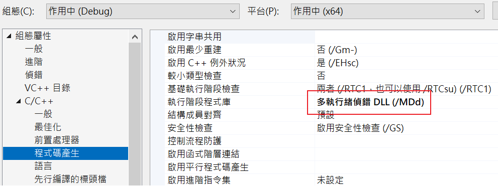

# Libgcrypt in C/C++ on Windows
## Download
* [Pre-built libgcrypt](https://github.com/ShiftMediaProject/libgcrypt/releases)

## Include Libgcrypt libraries in Visual Studio
### Project configure

* ```[專案] -> [屬性] -> [C/C++] -> [一般] -> [其他Include目錄] -> [Add "include" folder which is inside the donwloaded pre-built libgcrypt]```


* ```[專案] -> [屬性] -> [連結器] -> [一般] -> [其他程式庫目錄] -> [Add path to folder that contains the library according to dynamic/static and Win32/x64]```

### Dynamically Link

* ```[專案] -> [屬性] -> [連結器] -> [輸入] -> [其他相依性] -> [Add gcrypt.lib]```


* Copy ```gcrypt.dll``` from pre-built libgcrypt to the project folder
### Statically Link

* ```[專案] -> [屬性] -> [連結器] -> [輸入] -> [其他相依性] -> [Add libgcrypt.lib]```


* ```[專案] -> [屬性] -> [C/C++] -> [程式碼產生] -> [執行階段程式庫] -> [/MDd]```
* The output executable file is still standalone (Can be runned on other Windows PC)

### Headers
```c
#include <gcrypt.h>
#include <gpg-error.h>
```

## Example
I've included some common cryptography algorithm examples using libgcrypt libraries' high level API. Check out [symmetric block cipher template](./template.cpp) to write your own symmetric cryptography program with minor modification.

## Credits
* Thanks for the pre-built libraries from [Shift Media Project](https://github.com/ShiftMediaProject)

## References
* [ShiftMediaProject libgcrypt](https://github.com/ShiftMediaProject/libgcrypt)
* [gcrypt.lib vs. libgcrypt.lib](https://github.com/ShiftMediaProject/libgcrypt/issues/3)
* [The Libgcrypt Reference Manual](https://gnupg.org/documentation/manuals/gcrypt.pdf)
* [Crypto Programming with GCrypt](https://wiki.ucalgary.ca/images/8/8f/Wk6.Session2.pdf)
* [Libgcrypt examples](https://cboard.cprogramming.com/c-programming/105743-how-decrypt-encrypt-using-libgcrypt-arc4.html)
* [Introducing the libgcrypt Encryption Library](https://sudonull.com/post/159033-Introducing-the-libgcrypt-Encryption-Library)